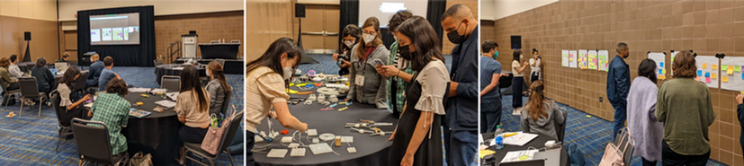
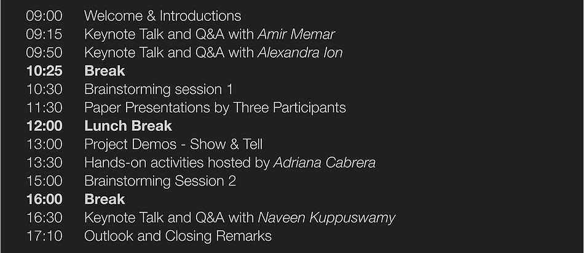
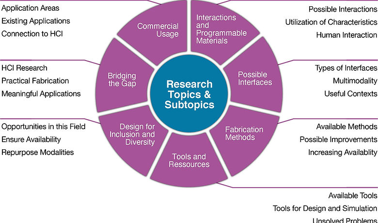

# CHI'22 Paper Page

> Source: https://www.softrobotics.io/chi22

#### [FlowIO](https://www.softrobotics.io)

##### [Platform](https://www.softrobotics.io)

# Workshop on Soft Robotics for HCI

#  Actuated Materials and Soft Robotics Strategies  
for Human-Computer Interaction Design

###### [ACM CHI'22 Conference](https://chi2022.acm.org/)[,](https://chi2022.acm.org/) New Orleans, LA, USA  
May 1, 2022, 9am - 5:30pm (Central Time)  
Hybrid event (onsite + virtual)

This workshop explores how to make soft robotics research, prototyping, and innovation more accessible to HCI researchers and designers.

[Overview ](https://www.softrobotics.io/chi22)

[Research ](https://www.softrobotics.io/chi22)

[Schedule ](https://www.softrobotics.io/chi22)

[Participation ](https://www.softrobotics.io/chi22)

[Papers ](https://www.softrobotics.io/chi22)

[Speakers ](https://www.softrobotics.io/chi22)

[Organizers ](https://www.softrobotics.io/chi22)

######   
  
Overview  

The fields of programmable matter and soft robotics are becoming increasingly relevant for the design of novel and convenient applications and experiences in Human-Computer Interaction (HCI). Thus far, application examples demonstrated in HCI include on-skin sensors allowed by nanometer-thin arrays of conductive and dielectric membranes, stretchable optical fibers that can reconstruct the hand pose and external interaction, haptic arrays enabled by fluidic elastomeric actuators, stretchable sensor skins on inflatable structures, soft exoskeletons powered by artificial muscles, stretchable screens, and many more. 

  
While we observe an ongoing paradigm shift transforming the HCI design space from rigid towards highly compliant, there are many challenges at the intersection between HCI and the aforementioned fields related to fabrication methods, development tools, resource availability, nomenclature, design for inclusion, etc. 

  
This one-day workshop will explore how to make soft robotics prototyping and innovation more accessible to both researchers and non-researchers. We will (1) investigate and identify the various difficulties designers face in the creation of HCI applications that require the transfer of knowledge from other domains, and (2) discuss possible solutions and visions on how to overcome those difficulties. The workshop will accommodate up to 30 participants and allow a space for critical discussion and exchange of experiences in the interplay of HCI and Soft Robotics.  

See our workshop proposal paper for more details. ([pdf](https://www.softrobotics.io/_files/ugd/cefaa7_852d7e7e68c946fd85d502aa4e27df7d.pdf))

Photos from the workshop

######   
  
Schedule  

[^ Back to Top ^](https://www.softrobotics.io/chi22)

The workshop will have a hybrid format consisting of (a) an onsite session in New Orleans, Louisiana, USA at the venue of the [CHI 2022 conference](https://chi2022.acm.org/) and (b) a virtual track for remote participants. Both tracks will run in parallel. 

To make the workshop more engaging and interactive, and help facilitate more interesting conversations, we encourage participants to bring examples of their own projects if possible. We will also have some soft robotic starter kits and several [FlowIO](https://www.softrobotics.io) devices available for participants to use during the workshop.

######   
  
Research  

[^ Back to Top ^](https://www.softrobotics.io/chi22)

During the workshop, we will be exploring a variety of research topics and questions across multiple categories. We will bring experts from all relevant domains and focus on technologies that are mature enough to be applied as interaction substrates. 

Interaction: 

  * What new interactions are enabled by programmable materials? 

  * Which materials are best suited for which interactions? 

Interfaces:

  * What types of visual, haptic, audio, and multimodal interfaces are possible using Soft Robotics? 

  * How can they be implemented into applications that are of interest to the HCI field?

  * In which contexts would such interfaces be useful or helpful?

Fabrication

  * Which fabrication methods are readily available to HCI researchers and hobbyists?

  * What are the fabrication pipelines, required work environments, materials, and equipment?

  * How can fabrication methods be made more accessible, affordable, faster, and simpler for everyone?

Tools and Resources

  * What tools, resources, and contents are needed for design and prototyping with programmable materials?

  * How can those required tools and resources be made available to all interested users?

  * What possible opportunities do you find in your own workflow to greatly increase your productivity?

  * How can we lower the entry barrier for people from technical and non-technical backgrounds to start incorporating programmable materials and soft robotics strategies into their projects?

Design for Inclusion

  * What contexts exist where the affordances of soft robotics can be explored for inclusion and diversity?

  * What are the context-specific benefits of soft robotics in design for inclusion and diversity?

Bridging the Gap

  * What can be done to bring together HCI research, practical fabrication, and novel areas of use? 

  * What other research fields can be connected to HCI such as Materials Science, Soft Robotics, or Microsystems Engineering?

Commercial Usage of interest to HCI

  * Where are soft robots and programmable materials used commercially?

  * What are commercial applications that are of relevance to the HCI community?

  * What other commercial opportunities exist that may benefit from the affordances of soft robotics?

######   
  
Participation  

[^ Back to Top ^](https://www.softrobotics.io/chi22)

##### Workshop Goals

Our aim is to identify the various challenging aspects people face when developing projects involving soft and programmable matter, the tools and resources that are needed to address those challenges, and the opportunities to make the design, prototyping, and control of soft programmable materials more accessible to HCI researchers and makers.  

##### Call for Papers

We invite submissions that demonstrate challenges and new opportunities related to the design, fabrication, implementation, or deployment of soft robotics for interaction design. Submissions can also be on any other topic related to the workshop goals. We have a two-step submission process:

Step 1: Communicate your intent to participate by submitting a one-paragraph abstract by February 20, 2022.

Step 2: Submit a short paper (2-5 pages long including references) by February 28, 2022.

  * Papers must be formatted in the [CHI Extended Abstract format](https://chi2022.acm.org/for-authors/presenting/papers/chi-publication-formats/) and submitted as non-anonymized PDF.

[(1) Participation Intent Form](https://docs.google.com/forms/d/e/1FAIpQLSex5s_sfwkR6y66PFOvlryZDOqwyJKhItvgAnTC6auviPRg8Q/viewform?usp=sf_link)

##### Deadline: February 28, 2022, midnight AoE.

[(2) Paper Submission Form](https://docs.google.com/forms/d/e/1FAIpQLSclDHUNXTBqorUe5f8FnFW2YnwYT21O7kZ9HNx3tz4glSmc7w/viewform?usp=sf_link)

##### Deadline: February 28, 2022, midnight AoE.

##### Selection and Notification

  * The submissions will be reviewed by the organizers (and additional experts, if required) and evaluated in terms of relevance to the workshop, significance of the content, and quality of the writing.
  * Acceptance decisions will be emailed by March 21, 2022.
  * Upon acceptance, at least one author of each accepted position paper must attend the workshop.
  * Workshop participants must register for both the workshop and for at least one day of the main conference. For more details about registration, visit [chi2022.acm.org](https://chi2022.acm.org)
  * Accepted participants will have until April 10, 2022 to submit the camera-ready version of their papers.
  * The accepted papers will be made publicly available on this website.

##### Note to Authors

Submitting a paper to this workshop does not disqualify you from later publishing that work in a conference or journal, because the workshop papers will not appear in the formal conference proceedings. Moreover, If you already have published a paper related to the goals of this workshop, you are welcome to submit to this workshop a similar paper - but focused more on the challenges you faced while executing the project and on opportunities to reduce those challenges.

######   
  
Invited Speakers  

[^ Back to Top ^](https://www.softrobotics.io/chi22)

We have invited speakers from academia and industry with different backgrounds at the intersection of interaction design and soft robotics. Each speaker will give a keynote to highlight their perspective on the research area. These keynotes will serve as openers for the different sections of the workshop. A discussion after each keynote will provide an opportunity to further intensify the exchange among all workshop participants, or allow the speakers to elaborate more deeply on specific topics of interest.

Alexandra Ion is an Assistant Professor at the Human-Computer Interaction Institute at Carnegie Mellon University, School of Computer Science. She leads the Interactive Structures lab, which investigates and develops interactive design tools that enable digital fabrication of complex structures for novice users. Her research and expertise lie at the intersection of HCI, computational fabrication, and material engineering. Her work has been published in and awarded by premier venues, including ACM UIST and CHI.

Amirhossein Memar is a Research Science Manager at Meta Reality Labs Research. His research focuses on bringing the sense of touch into AR/VR and enabling tangible interactions with virtual spaces. In particular, he is interested in the fundamental science and large-scale integration of novel soft actuators, sensors, and control algorithms for developing low-friction wearable interfaces. He holds a Ph.D. degree in mechanical engineering from the State University of New York at Buffalo.

Naveen Kuppuswamy is a Senior Research Scientist at Toyota Research Institute, in the Manipulation (Robotics Research) Group. His research interests are in tactile perception and control, and soft robotics for robust manipulation in homes. Previously he was a visiting researcher with the Robotics and Perception Group, University of Zürich and a Postdoctoral Researcher at the Dynamic Interaction Control Group, Istituto Italiano di Tecnologia, where he worked on tactile sensing and state estimation for humanoids and humans. He holds a Ph.D. from the University of Zürich and an M.S. from KAIST.

######   
  
Invited Host  

For the hands-on session of our workshop, we have invited an experienced researcher with expertise in leading workshops on digital fabrication and soft robotics.[Link to resources for the hands-on part of the workshop](https://drive.google.com/drive/folders/152h8KCPQ8Mp9T86HDGX99ywI2fSzOE18?usp=sharing).

Adriana Cabrera is the innovation manager at shemakes.eu, a project dedicated to empowering female innovators of the future by bridging the gender gap. She is a senior consultant in creative Labs and Hubs at matrix GmbH & Co., as well as a guest researcher for FabLab Kamp-Lintfort, Germany, at the Rhine–Waal University of Applied Sciences. As a global lecturer in the soft robotics the advanced program Fabricademy, her works involve the use of digital fabrication, textiles and wearability in the manufacturing process. Adriana is an Instructor of the Academany by the FabFoundation and co-leads fabcare.network , making health and care more inclusive and innovative. Originally from Colombia, she works in diverse areas of design and tangible interaction. Having a background in industrial design, she complemented her studies with an MFA in Media Art and Design at Bauhaus University Weimar and later with an MA in Surface and Textile Design at the Weißensee Academy of Art Berlin, focusing on materials research.

######   
  
Accepted Papers  

[^ Back to Top ^](https://www.softrobotics.io/chi22)

ActuAir: Exploring physicalizations of air quality at the workplace 

[Button ](https://www.softrobotics.io/_files/ugd/7cb36b_26bb848495284518ab0bca8933f0ec54.pdf)

Eleni Margariti

Open Lab, Newcastle University

Designing and Fabricating Pneumatic Textures for Human-Robot Interaction

[Button ](https://www.softrobotics.io/_files/ugd/7cb36b_7794b9ab8e3a438e872ddf5cc8e4d83e.pdf)

Yuhan Hu

Cornell University

PneuBots: Modular Inflatables for Playful Exploration of Soft Robotics

[Button ](https://www.softrobotics.io/_files/ugd/7cb36b_cb01c07e31764e4386a1ef169cda39b7.pdf)

Hye Jun Youn

Harvard Graduate School of Design

Application of soft robotics for shape-changing fashions: a speculative study

[Button ](https://www.softrobotics.io/_files/ugd/7cb36b_d52479dc382b48b1b9a19908601da87c.pdf)

Lionel Wong

The Hong Kong Polytechnic University

Liminal Beings': Soft Pneumatic Actuators as Breathing Objects

[Button ](https://www.softrobotics.io/_files/ugd/7cb36b_9fbe40ca9c1f4e79892bdc86f976e73a.pdf)

Gizem Oktay

University of Texas at Dallas

Designing a Soft, Mobile Interface for Multimodal Human-Robot Interaction

[Button ](https://www.softrobotics.io/_files/ugd/7cb36b_6a12931103ee454593f1b78938e9e85f.pdf)

Jeena Park

Cornell University

From Textiles to Soft Robotics and the Emergent Approaches in Labs and Hands-on Practices

[Button ](https://www.softrobotics.io/_files/ugd/7cb36b_fd8da19aacba49f8a998332a6835a8cd.pdf)

Adriana Cabrera

matrix GmbH & Co KG

Deformation Gesture-based Non-visual Drawing Tool

[Button ](https://www.softrobotics.io/_files/ugd/7cb36b_b6fd3e323bc947afba2c461c4946393b.pdf)

Pranjal Borah

Indian Institute of Technology Guwahati

Unveiling users’ perception of soft robotic UIs: Impact of surface softness on users’ perception of surface curvature

[Button ](https://www.softrobotics.io/_files/ugd/7cb36b_f36b5d2082064f5f91bc432e8d3c2d9c.pdf)

Zhuzhi FAN

CNRS, Université Grenoble-Alpes, LIG

Personal Fabrication with Active Materials applied to Soft Robotics Strategies in Human-Computer Interaction Design

[Button ](https://www.softrobotics.io/_files/ugd/7cb36b_5bbb497db61d47aa8b87bcb9c9ed79f6.pdf)

Ollie Hanton

University of Bristol

What to Design Next: Actuated Materials and Soft Robots for Children

[Button ](https://www.softrobotics.io/_files/ugd/7cb36b_9f1a8fe34f214eb9a9cc11c9bdc07493.pdf)

Chris Hill

University of Colorado, Boulder

Review of the Manufacturing and Modeling Processes of a Soft Dielectric Electroactive Polymer Actuator

[Button ](https://www.softrobotics.io/_files/ugd/7cb36b_3d08b17ea42945e9b2291aaaa84e42a7.pdf)

Jakub Kołota

Poznan University of Technology

Democratizing Magnetic Soft Materials Fabrication

[Button ](https://www.softrobotics.io/_files/ugd/7cb36b_6858295c7ab94be28ef596686baca55f.pdf)

Alex Mazursky

University of Chicago

Synergetic Collaboration between Intimate Touch and Soft Robotics: Opportunities and Challenges

[Button ](https://www.softrobotics.io/_files/ugd/7cb36b_fc01bbb525374bfda21e41bc8779f5b7.pdf)

Jooyoung Park

KTH Royal Institute of Technology

The Rise of Organic Soft Robotics : Strategies for Fabrication

[Button ](https://www.softrobotics.io/_files/ugd/7cb36b_5925ddd7b510481bb272ef19749e4776.pdf)

Madalina Nicolae

Léonard de Vinci Pôle Universitaire

LowSoRo

[Button ](https://www.softrobotics.io/_files/ugd/7cb36b_880811ee77fa435eb37c05825834ba79.pdf)

Lepart Selma

EHESS / LIRMM

Threads of Possibility: Diverse Youth Designers, Soft Robotics, and Sports Wearables

[Button ](https://www.softrobotics.io/_files/ugd/7cb36b_1902d3bddd3743ae9e47f7a5b9f93fd1.pdf)

Herminio Bodon

northwestern university, tiilt lab

######   
  
Organizers  

[^ Back to Top ^](https://www.softrobotics.io/chi22)

If you have any questions about the workshop, please [contact the organizers](https://docs.google.com/forms/d/e/1FAIpQLSdKvZBlLPECvAUEFLa3MGY84TSrRDvhPglTh6xW01ABD85vbA/viewform?usp=sf_link).

Anke Brocker

RWTH Aachen University

Jose Barreiros

Cornell & ETH Zurich

Ali Shtarbanov

MIT Media Lab

Ozgun Kilic Afsar

KTH & MIT Media Lab

Kristian Gohlke

Bauhaus University, Weimar

Sören Schröder

RWTH Aachen University

We would like to thank the following institutions for supporting our workshop

