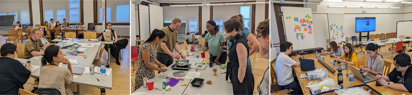
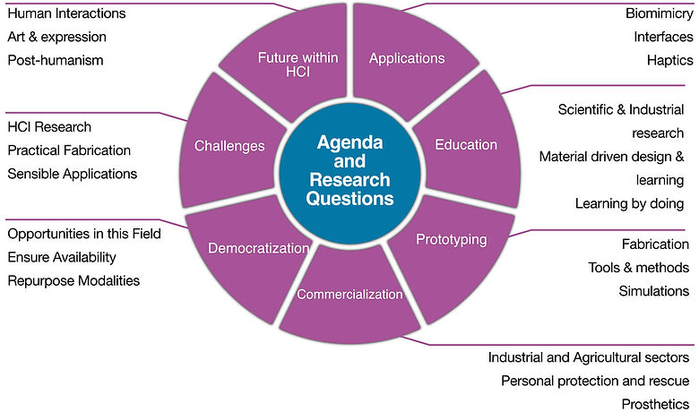
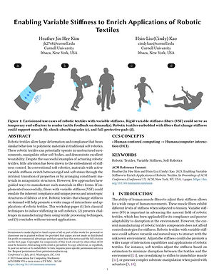
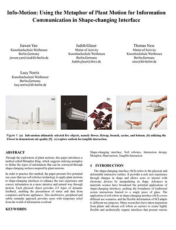
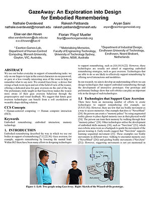
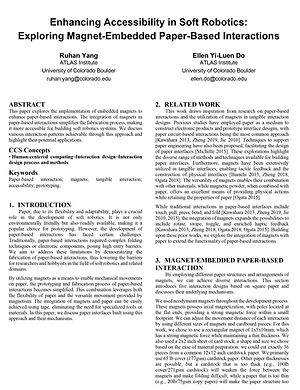
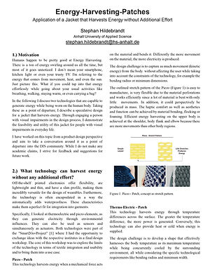
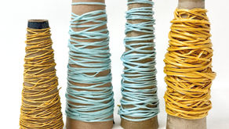

# DIS'23 Paper Page

> Source: https://www.softrobotics.io/dis23

# Workshop on Soft Robotics for HCI

#  Soft Robotics and Programmable Materials  
for Human-Computer Interaction

###### [ACM DIS'23 Conference](https://dis.acm.org/2023/workshops-at-dis23/), Pittsburgh, PA, USA  
July 10, 2023, Full day event, 9 a.m. - 6 p.m.

This workshop explores lowering the barriers to research, prototyping, and innovation with soft robotics and democratizing access opportunities.

We invite submissions of papers, videos, or tutorials

[Overview ](https://www.softrobotics.io/dis23)

[Topics ](https://www.softrobotics.io/dis23)

[Submit ](https://www.softrobotics.io/dis23)

[Schedule ](https://www.softrobotics.io/dis23)

[Entries ](https://www.softrobotics.io/dis23)

[Speakers ](https://www.softrobotics.io/dis23)

[Organizers ](https://www.softrobotics.io/dis23)

######   
  
Overview  

Recently, subdomains of Human-Computer interaction (HCI), such as Tangible Interfaces and Haptics, have experienced disruptive hardware transformations owing to advances in Soft Robotics and Programmable Materials. How will these fields shape the future of HCI over the next decade and beyond? Unfortunately, the transfer of fundamental advances from basic science to end-user experiences can take years due to many interdisciplinary challenges. These include challenges related to fabrication methods, durability, tools, access to resources, and transfer of knowledge. How can we most effectively overcome such challenges, what opportunities exist to accelerate progress, and what application possibilities can we envision and contribute to the future? We aim for a comprehensive approach to soft robotics design and fabrication and concepts of future applications for their integration into daily life. 

This workshop will explore how to lower the barriers to prototyping, innovation, and design with dynamic materials and soft robotics; explore what new opportunities we can envision with those emerging hardware technologies for HCI and other human-centered applications; and identify ways of democratizing those possibilities. 

Photos from the workshop

[^ Back to Top ^](https://www.softrobotics.io/dis23)

######   
  
Topics of Interest  

During this participatory workshop, we will be exploring a variety of research topics and questions across multiple categories related to the workshop goals. We will explore current challenges and opportunities for advancing the field, making is more accessible, lowering barriers, accelerating innovation, and enabling new opportunities for creativity and expression. The following are some of the themes and questions of interest to this workshop.

Democratizing Prototyping & Fabrication:

  * Which new design and fabrication methods can be made available to HCI researchers & hobbyists, which currently are not?

  * How can we simplify the fabrication pipelines, requirements for work environments, materials, and equipment?

  * How can we make fabrication methods more accessible, affordable, faster, and simpler for everyone?

  * What new tools and resources are needed to make design and prototyping faster, easier, and simpler?

Democratizing Education Opportunities:

  * How can we engage designers, artists, and educators who want to implement innovative projects? 

  * How can required tools and resources be made available to all interested users?

  * What mechanisms and resources do we need to allow accessible learning practices of soft robotics for makers, STEAM and professionals?

  * Can we enable the engagement of different audiences and learners? 

  * How can we lower the entry barrier for people from various technical and non-technical backgrounds to start incorporating programmable materials and soft robotics strategies into their projects?

  * What educational resources and tutorials are lacking or inaccessible?

Enabling New Applications

  * What types of interactions can we envision using soft robots and actuated materials?

  * What types of visual, haptic, audio, and multimodal interfaces are possible using soft robotics? 

  * What real-world metaphors in nature can we rely on to enable our interactions with such shape-changing interfaces?

  * What are the limits to this flexibility and how does it affect the robustness of a soft robot/interface?

  * What new forms of art and creative expression can be made possible?

  * How can we relate art, new aesthetics, and the linking of creative areas from fashion to performance?

The graphic below shows an even broader range of topics of interest to this workshop. 

[^ Back to Top ^](https://www.softrobotics.io/dis23)

######   
  
Call for Submissions  

We invite submissions that demonstrate challenges and opportunities for design, fabrication, learning, or deployment of soft robotics, programmable materials, and related emerging technologies for human-centered applications. We also welcome any submission related to lowering the barriers to research, prototyping, innovation, and enabling new opportunities. 

Submissions can be the form of papers, videos, or tutorials.

Papers: 2-5 page long PDF in the 2-column ACM format

Videos: 1-3 minute-long project introduction plus demo

Tutorials: An instructional tutorial with detailed steps. No length limits.

Important Dates and Deadlines:

Express participation intent and indicate your preferred type of submission content.

[Submit a Paper](https://docs.google.com/forms/d/e/1FAIpQLSf0gxTmoT5_JTSu2V8KtNuCbeQWI7VsEDiHT5mQEuPfpwBvtQ/viewform?usp=sf_link)

###### or

[Submit a Video](https://docs.google.com/forms/d/e/1FAIpQLSd_npUHGZITpoiT9wsT7UawTHO_Dp7PuqchbIBgkKF0nYfnCQ/viewform?usp=sf_link)

###### or

Preferred format for presenting an idea, making a position statement, proposing a solution to any of the topics and questions above, or providing details about a system.

Preferred format for demonstrating systems, interactive applications, prototypes, and animations. Video are also great choice for conveying what-if and speculative ideas. 

[Express my Intent](https://forms.gle/1xDuLEAbZ3z8ptho8)

[Post a Tutorial *](https://www.softrobotics.io/posts/categories/project-tutorials)

Preferred format for showcasing how something was done, and how to replicate it. Tutorials can include text, graphics, and videos, and they can be of any length.

  * Acceptance decisions & revision requests will be emailed on a rolling basis within a week of your submission date. 
    * The earlier you submit, the sooner you will receive your acceptance decision.
  * Accepted participants must register for both the workshop and for at least one day of the DIS Conference. 
  * The accepted papers / videos / tutorials will be made publicly available on this website prior to July 10
  * Submitting a paper to this workshop does not disqualify that paper from also being submitted to a conference or journal.

* Posting a tutorial requires a [softrobotics.io](https://www.softrobotics.io) account. In the sign-up form, please indicate that you would like to post a tutorial, in order to be granted the appropriate permissions. Tutorials should follow [this structure](https://docs.google.com/document/d/1owfShd9wEHxaVSxjydQWcfDB66c3A0tGkYGj-ndFZRU/edit?usp=sharing), as demonstrated in [this example](https://www.softrobotics.io/post/making-simple-origami-soft-robots-from-low-cost-household-materials).

Workshop registration code: DISWorkshop[W.02]23

Audience Choice Awards \- During the workshop, the participants will select best submission in each category. Participants will be asked to rate each submission for clarity, appeal, effort, and relevance to the workshop using an anonymous online-voting system called Mentimeter. The organizers will announce the winners at the end of the workshop, who will then be listed on this website. While the value of the awards is recognition, we may also have some modest prizes from our sponsors.

NOTE: The DIS conference charges registration fees for workshops. The fees are NOT charged by the workshop organizers, but by the ACM / DIS conference for management and catering expenses. No portion of the fees can be used by the organizers to purchase materials for the workshop. Even we as organizers are required to pay the same registration, just to be able to host our workshop at DIS. Thus, we have no control over registration fees and no ability to do anything about them.

######   
  
Accepted Entries  

[^ Back to Top ^](https://www.softrobotics.io/dis23)

\- - - - - - - - - - - Papers - - - - - - - - - - - -

Heather Kim, Cindy Kao

Cornell University

Hybrid Body Lab

Jiawen Yao, et.al.

Berlin-Weissensee Art Academy

Nathalie Overdevest, et.al.

Monash University

Ruhan Yang, Ellen Do

University of Colorado

ATLAS Institute

Stephan Hildebrandt

Anhalt University of Applied Sciences

\- - - - - - - - - - - Videos - - - - - - - - - - -

Binyan Xu

New York University, ITP-Interactive Telecommunication

Jiawen Yao

Berlin-Weissensee Art Academy

Sonia Roberts

Wesleyan University

Hye Jun Youn

Harvard University Graduate School of Design

Tigmanshu Bhatnagar

University College London

Yu Dikai

Aalto University & Tongji University

Eldy Lazaro Vasquez

ATLAS Institute, CU Boulder

\- - - - - - - - - - - Tutorials - - - - - - - - - - -

## [Making modular McKibben Muscles using a cleaner more precise technique](https://www.softrobotics.io/post/muscles)

Tutorial on how to make modular McKibben soft robotic muscles using a new and improved technique

[Ali Shtarbanov](https://www.softrobotics.io/profile/softroboticsio/profile)

## [How to make soft biofoam strings](https://www.softrobotics.io/post/how-to-make-soft-biofoam-strings-exploring-an-affordable-and-accessible-fabrication-method)

Exploring an affordable and accessible fabrication method to make soft biofoam strings.

[Eldy Lazaro Vasquez](https://www.softrobotics.io/profile/eldylazaro/profile)

## [Transform a thin sheet of Nitinol into a passive refreshable tactile display](https://www.softrobotics.io/post/transform-a-thin-sheet-of-nitinol-into-a-passive-tactile-display)

Learn to make a passive refreshable tactile display with Nitinol

[Tigmanshu Bhatnagar](https://www.softrobotics.io/profile/t-bhatnagar-18/profile)

• • • Audience Choice Winners • • •

Paper category: 

  * 1st Place:

"Enabling Variable Stiffness to Enrich Applications of Robotic Textiles" 

Heather Kim, Cornell University

  * 2nd Place:

"Info-Motion: Using Plant Motion Metaphor for Information Communication in Shape-changing Interface" 

Jiawen Yao, Berlin-Weissensee Art Academy

Video category:

  * 1st Place:

"Airbit - A creation democratization toolkit for soft robotics"

Yu Dikai, Aalto University

  * 2nd Place:

"Directionally selective knitted strain sensors"

Sonia Roberts, Wesleyan University 

Tutorial category:

  * 1st Place:

"How to make soft biofoam strings"

Eldy Lazaro Vasquez, ATLAS Institute at CU Boulder

  * 2nd Place:

"Make a Robotic Strap: Strong yet flexible robots for lifting humans"

Kentaro Barhydt, Massachusetts Institute of Technology (MIT)

######   
  
Workshop Schedule  

[^ Back to Top ^](https://www.softrobotics.io/dis23)

09:00 - Introduction

09:30 - Inspiration Keynote with Q&A

10:15 - --\--- Short break \-----

10:30 - Paper and Video Presentations

10:30 - Jiawen Yao  
10:35 - Ruhan Yang  
10:40 - Stephan Hildebrandt  
10:45 - Heather Kim  
10:50 - Nathalie Overdevest  
10:55 - Binyan Xu  
11:00 - Yu Dika  
11:05 - Tigmanshu Bhatnagar  
11:10 - Sonia Roberts  
11:15 - Hye Jun Youn

11:20 \- Brainstorming 1

a) Democratizing Prototyping and Fabrication

b) Democratizing Educational Opportunities

c) Novel Applications

12:30 - ----- Lunch Break \-----

13:15 \- Tutorial Presentations

13:15 - Tigmanshu Bhatnagar

13:20 - Kentaro Barhydt

13:25 - Eldy Lazaro Vasquez

13:30 - Hands-on activities (selected Tutorials)

15:30 - Demos of hands-on activities

16:00 - ----- Short Break \-----

16:15 - Brainstorming 2

a) Democratizing Prototyping and Fabrication

b) Democratizing Educational Opportunities

c) Novel Applications

17:30 - Closing

######   
  
Keynote Speaker  

[^ Back to Top ^](https://www.softrobotics.io/dis23)

Scott Hudson is a Professor of Human-Computer Interaction at Carnegie Mellon and previously held positions at the University of Arizona and Georgia Tech. He has published extensively in technical HCI. He recently received the ACM SIGCHI Lifetime Research Award. Previously he received the ACM SIGCHI Lifetime Service Award, was elected to the CHI Academy, and received the Allen Newell Award for Research Excellence at CMU. His research interests within HCI are wide ranging, but tend to focus on technical aspects of HCI. Much of his recent work has been considering advanced fabrication technologies such as new machines, processes, and materials for 3D printing, as well as computational knitting and weaving, and applications of mechanical meta-materials. <https://www.cs.cmu.edu/~hudson/>

######   
  
Organizers  

[^ Back to Top ^](https://www.softrobotics.io/dis23)

[Ali Shtarbanov](http://www.shtarbanov.com)

MIT Media Lab

[Anke Brocker](https://hci.rwth-aachen.de/brocker)

RWTH Aachen University

[Adriana Cabrera](http://www.acart.design)

Rhine-Waal University

[Yuhan Hu](https://www.yuhanhu.net)

Cornell University

[Heiko Müller](https://hci.uni-oldenburg.de/team-details/heiko-muller/)

University of Oldenburg

[Alex Mazursky](https://www.alexmazursky.com/)

University of Chicago

[Contact us](https://docs.google.com/forms/d/e/1FAIpQLScuCKsfk1nDcAgyGC_I0UWPQu3MiXOGAvQjiC9q7JAOn3WD9A/viewform?usp=sf_link)

We thank the following companies for providing partial sponsorship:

