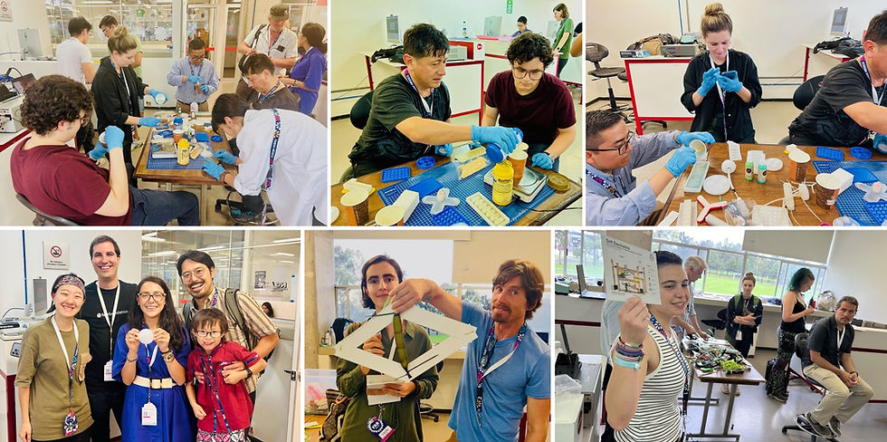
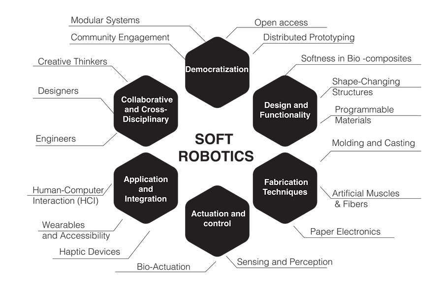
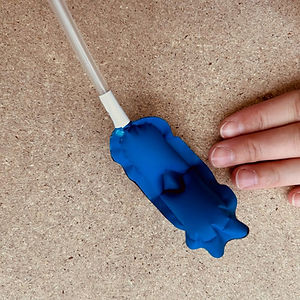
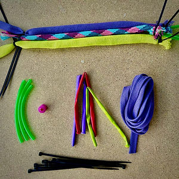
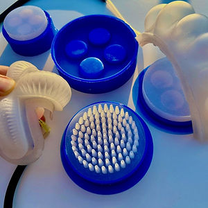
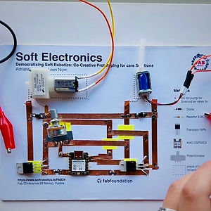
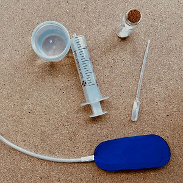
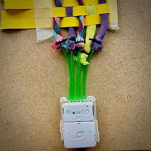

# FAB24 Paper Page

> Source: https://www.softrobotics.io/fab24

# Curated Workshop on Soft Robotics @ FAB24

# Democratizing Soft Robotics: Co-Creative Prototyping for care Solutions

###### [FAB24 Conference](https://fab24.fabevent.org/programs/schedule?day=2024-08-08&title=democratising-soft-robotics-co-creative-prototyping-for-care-solutions&event=86f2194b-44c1-479c-81da-ae3917f7c0d2), Puebla, Mexico  
August 8th, 2024, 2 p.m. - 6 p.m.

Half-day workshop on democratizing prototyping, innovation, and research with soft robotics for co-creation and sustainable care. You can bring your demos and share your experiences in creating soft robots with the Fab community.

[Overview ](https://www.softrobotics.io/fab24)

[Topics ](https://www.softrobotics.io/fab24)

[Participation ](https://www.softrobotics.io/fab24)

[Schedule ](https://www.softrobotics.io/fab24)

[Tutorials ](https://www.softrobotics.io/fab24)

[Keynote ](https://www.softrobotics.io/fab24)

[Organizers ](https://www.softrobotics.io/fab24)

######   
  
Overview  

The compliant nature of soft robotic devices makes them of significant interest for healthcare and wearable applications where comfort, portability, and natural movement are required. Spaces like the Fab Conference, which combine various techniques, tools, and knowledge, are ideal for ideation and prototyping in soft robotics. This half-day workshop will explore democratizing prototyping, innovation, and research with soft robotics for co-creation and sustainable care. You are invited to bring your demos and share your experiences in creating soft robots with the Fab community.

Photos from the workshop

######   
  
Topics  

[^ Back to Top ^](https://www.softrobotics.io/fab24)

The proposed workshop aims to provide a collaborative environment, fostering a co-creative session and hands-on exploration in soft robotics prototyping. Utilizing techniques such as sealing and knitting machines, we aim to co-create appropriately adapted wearables.

  * Fostering brainstorming sessions on shapes and bio-inspired design.

  * Exploring manufacturing possibilities like sealing and 3D printing.

  * Delving into electronics and interface design, utilizing tools such as FLOW.IO.

  * Integration and adaptation of these technologies.

######   
  
Participation  

[^ Back to Top ^](https://www.softrobotics.io/fab24)

Join us for the workshop, "Democratising Soft Robotics: Co-Creative Prototyping for Care Solutions." Share your expertise, experiences, and demos. We invite you to present prototypes and experiences with soft robotics, wearable technologies, and programmable materials, whether physical or digital.  
  
Please let us know through this form if you can participate. We would also like to know how we can reach you for future collaborations.  
  
We look forward to seeing you at this gathering during the Fab24 conference in Mexico!

[Express my Intent](https://forms.gle/f9TawswYpUBaeqcU7)

[Add to my Plan](https://fab24.fabevent.org/programs/schedule?day=2024-08-08&title=democratising-soft-robotics-co-creative-prototyping-for-care-solutions&event=86f2194b-44c1-479c-81da-ae3917f7c0d2#program-day-2024-08-08)

######   
  
Tutorials  

[^ Back to Top ^](https://www.softrobotics.io/fab24)

\- - - - - - - - - - - Fabrication - - - - - - - - - - - -

Inflatables

Inflatables and Sealing Technique

Learn to design and fabricate inflatable soft robotics with sealing methods, crucial for creating adaptable and comfortable healthcare devices.

Artificial Muscles

McKibben and various Fibers

Delve into the construction of artificial muscles using McKibben actuators and diverse fibers, focusing on achieving forceful and mechanical actuation. This session will explore how different fabrics can be utilized to enhance natural movements in soft robotic systems. Participants will experiment with various configurations to understand how these materials influence movement in multiple directions, significantly enhancing the functionality of assistive technologies.

Perception

Moulding and Casting

Master the art of molding and casting to create pneumatic actuators and sensory structures that enrich soft robotic systems with haptic feedback and enhanced perception. This process allows for the exploration of complex shapes and configurations, improving the interactivity and responsiveness of healthcare robots by offering more precise and adaptable ways to simulate human touch and interaction.

\- - - - - - - - - Control and Actuation - - - - - - - - -

Paper Electronics

for Soft Actuation

Experiment with paper electronics to build flexible, low-cost circuits, facilitating the development of lightweight and efficient soft robotic actuators. This session will also introduce the integration of the XIAO ESP32C3, enabling wireless connectivity to control and monitor these actuators remotely, enhancing their functionality and application in dynamic environments.

Bio Actuation

for Soft Actuation

Dive into bio-inspired actuation and control systems that seamlessly integrate using basic, organic ingredients. This session explores how natural forms and materials can be harnessed for actuation, offering a more intuitive and organic approach to controlling movements in soft robotic systems.

FlowIO Platform

for Soft Actuation

Utilize the modular platform FlowIO to program and manage soft robotics, gaining a deeper understanding of the diverse possibilities for making and actuating your designs. This session will guide participants through the capabilities of Flow.io, showcasing how it can enhance the precision and versatility of robotic controls, allowing for sophisticated and customizable actuation strategies.

######   
  
Workshop Schedule  

[^ Back to Top ^](https://www.softrobotics.io/fab24)

14:00 - Introduction

14:15 - Inspiration Keynote with Q&A

14:45 - --\--- Short inspiration and announcements \-----

15:00 \- Fabrication

a) Inflatables sealing 

b) Moulding and casting 

c) Artificial Muscles

15:40 - Actuation & Control

a) paper electronics 

b) Bio Actuation 

c) Control and Perception using FlowIO

16:20 - ----- Lunch Break \-----

16:30 \- Integration 

17:30 - Presentation and Awards 

17:45 - Closing

######   
  
Keynote Talk  

[^ Back to Top ^](https://www.softrobotics.io/fab24)

[Ali Shtarbanov](https://www.shtarbanov.com)

MIT Media Lab

SoftRobotics.IO founder

Ali Shtarbanov is dedicated to removing barriers to creativity and making innovation and prototyping in emerging fields faster and more accessible for everyone. He develops general-purpose tools and platforms that enable makers, researchers, artists, and designers to rapidly turn ideas into reality. Inspired by platforms like Arduino and Raspberry PI that have democratized electronics and computing, Ali's current work focuses on building and globally deploying innovative hardware and software platforms for rapid prototyping with soft robotics, programmable materials, and wearable haptics. More details about his work are available on the about page.  
  
Ali is an Electrical & Systems Engineer and an HCI Researcher / PhD Candidate at MIT, whose research areas include Modular development platforms, Creative ecosystems, Soft Robotics, and Haptics. See more at [www.shtarbanov.com](http://www.shtarbanov.com)

######   
  
Organizers  

[^ Back to Top ^](https://www.softrobotics.io/fab24)

[Adriana Cabrera](http://www.acart.design)

Collaborating Center on Sustainable Consumption and Production CSCP

[Leen Nijim](https://fabacademy.org/2022/labs/kamplintfort/students/leen-nijim/about_me.html)

Fab Academy Alumna 2022

[Frauke Waßmuth](https://fabacademy.org/2024/labs/kamplintfort/students/frauke-wassmuth/about-me.html)

Rhine-Waal University

[Prof. Dr. William Megill](https://www.hochschule-rhein-waal.de/en/faculties/technology-and-bionics/organisation-and-office-hours/professors/prof-dr-william-m-megill-12)

Rhine-Waal University

[Prof. Dr. Lily D. Chambers](https://www.hochschule-rhein-waal.de/de/user/8555)

Rhine-Waal University

[Sophia Döring](https://drive.google.com/file/d/1egXdXWbBSpXLYcNo-SoMsCv7wfmMvMNO/view?usp=sharing)

Rhine-Waal University

[ Contact us](mailto:adriana.cabrera.g@gmail.com)

We thank the following organizations for providing support:

