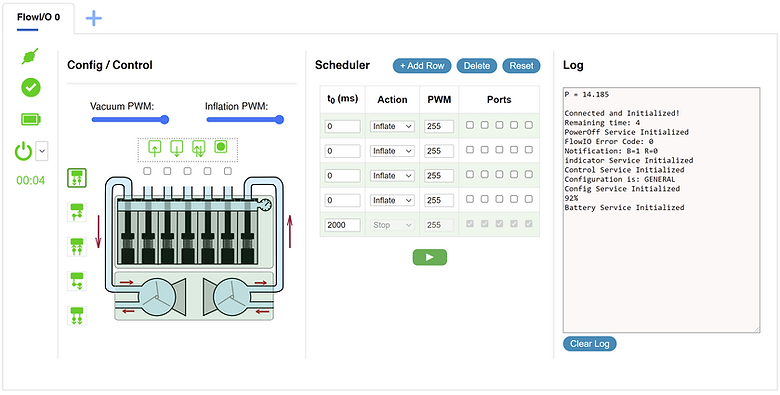

# GUI Overview

> Source: https://www.softrobotics.io/gui-overview

The Graphical User Interface (GUI) for FlowIO runs in the web-browser. And as such, you don't need to download or install anything in order to use FlowIO. You simply launch the GUI web page and click the connect button to establish a Bluetooth connection between your web-browser and the FlowIO device.

Sidebar:

At the top of the sidebar the "Connect / Disconnect" button, which you press to connect to or disconnect from a FlowIO device. The button also also shows the current connection status. Underneath it are icons for device status, battery level, and a power off button with an Auto-Off timer. By default, the device is set to power itself off after 5 minutes of inactivity.

Scheduler:

A dynamic task scheduler allows you to define and execute a sequence of actions. Each row of the table lets you choose the starting time of the action in milliseconds, the type of pneumatic action, the PWM value for the flow rate, and the port(s) on which that action should take place. You can add as many tasks to the table as desired by clicking the "Add Row" button above the table. Once you have set your sequence parameters, you just click the play button to execute the sequence.

Config/Control:

An interactive device graphic showing the complete pneumatic representation of the connected FlowIO device, including the 7 valves, 2 pumps, and the connections between them. The graphic is interactive and dynamic to lets you see exactly what is happening inside the FlowIO device in real-time as you as you are working with the device.

The 5 checkmarks above the graphic correspond to the 5 pneumatic I/O ports. To choose which port(s) you want to work it, simply check the desired port(s). 

The 4 buttons above the checkmarks are the pneumatic action buttons for Inflation, Vacuum, Release, and Stop. For example, if you want to start vacuum on ports 3 and 4, you would put a checkmark in those 2 ports and then click on the vacuum button.

The two blue sliders above the buttons control the flow-rate the inflation and vacuum pumps, by controlling the PWM values of the signal driving each pump.

The 5 buttons to the left of the graphic allow you to change the pneumatic configuration between General, Series Inflation, Series Vacuum, Parallel Inflation, and Parallel Vacuum. Changes in the pneumatic configuration are immediately reflected in the interactive graphic. 

Log:

A status log showing real-time device feedback. In the status log, you can read information about the everything that is happening to the device, as well as readings from the various sensors embedded inside FlowIO. 

Tabs (top):

The GUI is tab-based to allow you to connect allows multiple FlowIO devices simultaneously. If you want to connect a second FlowIO device, simply click the blue "+" button to add another device tab with its own independent set of controls. You connect and control several FlowIO devices to the same interface.

[Get Involved ](https://www.softrobotics.io/contribute)

Find out how you can help
