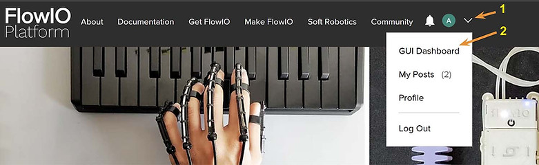

# Launch GUI

> Source: https://www.softrobotics.io/gui

######    
Graphical User Interface  

There is now a new and improved way of accessing the GUI Control Dashboard. For the first time, the GUI can now be personalized for each user, and we can now even add custom-made features specific to one's needs without affecting anyone else. Instead of one GUI that fits everyone, we now have a separate GUI for each individual account holder that can be tailored specifically to their project needs.

To access your personalized GUI Control Dashboard, Log In to your softrobotics.io account and then click on "GUI Dashboard" from the account dropdown menu or from your Profile page. Or you can also click [here](https://www.softrobotics.io/account/gui) to be taken to the page directly.

