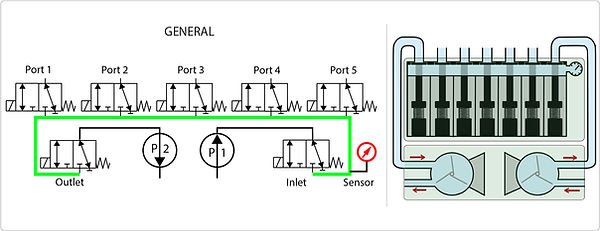
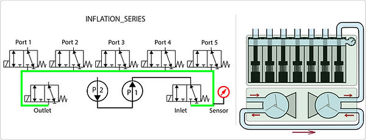
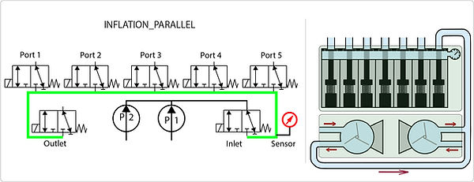
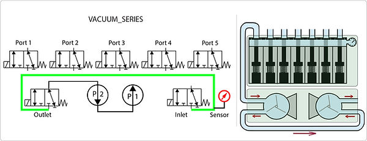
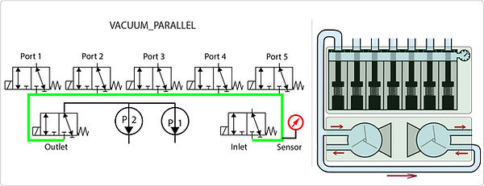

# Pneumatic Configurations

> Source: https://www.softrobotics.io/pneumatic-configurations

Each Pump-module of FlowIO integrates two pumps, which can be connected to the main module in 5 different ways, which we call configurations. The 5 supported pneumatic configurations are called: 

  * GENERAL

  * INFLATION_SERIES

  * INFLATION_PARALLEL

  * VACUUM_SERIES

  * VACUUM_PARALLEL

[Get Involved ](https://www.softrobotics.io/contribute)

Find out how you can help
