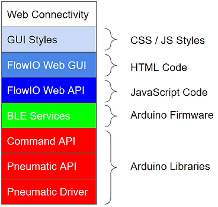

# Software Stack

> Source: https://www.softrobotics.io/software-stack

###### 

The software for FlowIO is written in an object-oriented style and consists of a stack with multiple layers of abstraction. The figure shows how the stack is built. Each higher layer depends on the layers below it. The lower 4 layers of the stack are written in C++ and are part of the embedded code running on the FlowIO device. The higher layers of the stack are written primarily and JavaScript and constitute the web-browser based portion of the FlowIO software. A brief description about each layer is provided below. 

The various layers of the software stack give users the freedom to interact with FlowIO in a variety of ways, ranging from interacting with the GUI and using the JavaScript API, to entering serial commands, to writing new firmware using the provided Arduino libraries.

Pneumatic driver \- contains the lowest level methods that control individual pneumatic components – pumps, valves, and pressure sensors. 

Pneumatic API \- control entire procedures involving multiple components, switching sequences, and configurations. 

Command API \- implements a custom protocol that maps all of the functions and methods supported by the Pneumatic API into 3-byte commands, that can be sent externally to the device using the serial or Bluetooth protocols. 

FlowIO firmware \- defines 8 custom BLE services with over 15 characteristics, enabling complete feedback-based real-time control of FlowIO over BLE.

Web API \- a JavaScript API based on the Web-Bluetooth protocol that enables the web-browser to establish a connection directly with one or more FlowIO devices via Bluetooth. The Web-API for FlowIO enables a complete control over the input and output features of FlowIO over Bluetooth connection. This is the most powerful layer of the entire stack, because it enables not only complete control of one device but also allows synchronous and asynchronous interactions between multiple devices. 

Web GUI \- a graphical representation for some of the functionalities enabled by the FlowIO web API. Not all features of the web API have yet been implemented in the GUI, and more improvements are being made to the GUI currently. 

GUI Styles \- the visual layout and appearance of the GUI. This layer is purely aesthetic and does not implement any new functionality.

Web Connectivity \- a layer that is enables communication between FlowIO devices over the internet. This layer is not part of the stable public release as it's still in early development.

[Get Involved ](https://www.softrobotics.io/contribute)

Find out how you can help
